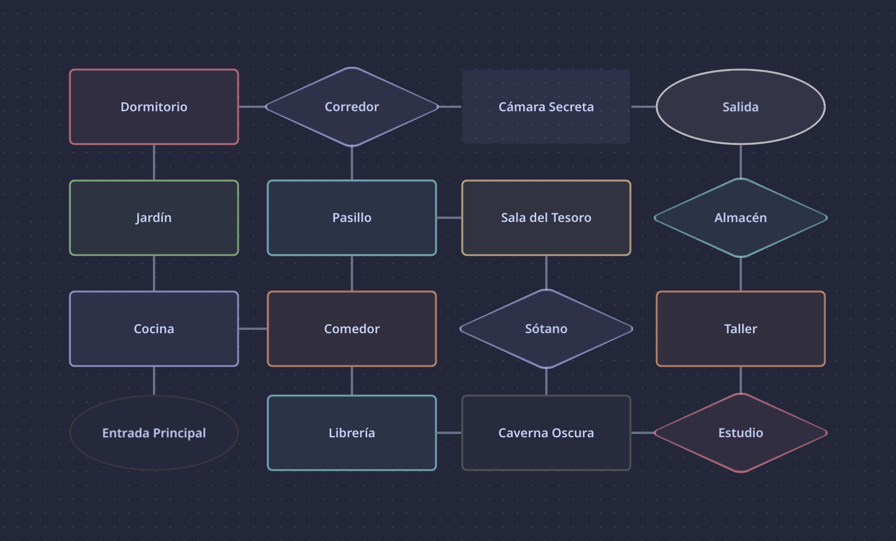

```
        ----       _____                 _      ____                  _   
     `/\(  )      / ____|               | |    / __ \                | |  
    | ^  \       | |  __ _ __ __ _ _ __ | |__ | |  | |_   _  ___  ___| |_ 
    | -  | \o    | | |_ | '__/ _` | '_ \| '_ \| |  | | | | |/ _ \/ __| __|
     /\\ /       | |__| | | | (_| | |_) | | | | |__| | |_| |  __/\__ \ |_ 
      |  |  _o_   \_____|_|  \__,_| .__/|_| |_|\___\_\\__,_|\___||___/\__|
      |  | |___|                    |_|                                   
```
# GraphQuest

**GraphQuest** es una aventura. En esta aventura, aventurarás.

<details>
<summary> <b> Mapa General del Juego (Spoilers)</b> </summary>
<div align="center"> <br/>



</div>
</details> 

## Requerimientos
- Tener un compilador de C (como **gcc**) instalado.
    - Para **Windows**, es recomendable utilizar **MinGW**.
    - Para sistemas basados en **Arch Linux**, se puede ejecutar en la terminal el comando `sudo pacman -S gcc` para instalarlo de los **paquetes oficiales** de Arch.

### Compilación y ejecución
<details>
<summary>
Para compilarlo, dentro del sistema operativo <b>Windows</b> usando <b>Visual Studio Code</b>: </summary>

1. Descargar este **repositorio** como archivo `zip` (haciendo **click** en la sección `code`, y apretando el botón de `Descargar ZIP`).
2. Abrir el **explorador de archivos** y navegar hasta el archivo `zip` para descomprimirlo. Una vez descomprimido, abrir el directorio con los archivos del programa.
3. Abrir el archivo `main.c` del `zip` en **Visual Studio Code**.
4. Dentro de **Visual Studio Code**, abrir el **terminal** y dirigirse a la dirección del repositorio, para poder compilar el programa.
5. Ejecutar el siguiente comando: `gcc headers/*.c *.c -o programa.exe`.
6. Abrir el archivo `programa.exe`, o escribir la línea `./programa.exe` en **Visual Studio Code** para ejecutarlo.
</details>

---
<details>
<summary>
Una forma alternativa de compilación, funcional para <b>Windows</b> y <b>Linux</b> (<b>Arch Linux</b> <i>testeado</i>): </summary>

1. Descargar el **repositorio** como archivo `zip`.
2. Abrir el **explorador de archivos** de su preferencia y navegar hasta encontrar el archivo `zip` para descomprimirlo.
3. Una vez descomprimido, buscar el directorio donde se ubica la carpeta descomprimida y buscar abrir el **terminal** en algunos de los sistemas operativos.

    - En **Windows**, se puede hacer **click derecho** en el directorio para abrir el menú de opciones y seleccionar para **abrir en Terminal**. Alternativamente, abrir **PowerShell** o **Línea de Comandos**, copiar la dirección del repositorio (la ruta `C:\Users\...`) y ejecutar el comando `cd "C:\Users\..."`.
    - En **Linux**, se puede ejecutar, dentro de la **terminal** de su preferencia, el comando `cd`, similar a como se hace en **Windows**. Es necesario copiar la dirección del repositorio (la ruta `"/home/$USER/..."`) y ejecutar el comando `cd "/home/$USER/..."` para acceder a la ruta del programa.
4. Ejecutar el comando: `gcc headers/*.c *.c -o programa`.
5. Escribir en la misma **terminal** el comando `./programa` para ejecutar la aplicación.
</details>

## Funciones del programa

El programa incluye dos menús principales que son utilizados para la carga del programa:

<details> 
<summary> <b> Menú Principal: </b> </summary>

- 

</details>

<details>
<summary> <b> Menú del Jugador: </b> </summary>

-
</details>

### Headers Propios

Este proyecto posee headers segmentados, encargados cada uno de distintas **funciones** que se implementaron. Al ser algo más enrevesado, mostraré los **headers esenciales** creados:

- `Extras`: Encargado de funciones varias que implemento en varios de los proyectos del ramo. Fue creada desde la primer tarea, pero ha sido y sigo modificándola para crear más funciones esenciales que uso para los proyectos.
- `GraphQuest`: Es el header encargado de la **funcionalidad de la lectura del laberinto**. Posee funciones propias que se encargan de poder acceder al archivo ubicado en `data` y crear un mapa funcional con las conexiones correspondientes a cada nodo.
- `GameSet`: El **header principal** del programa. Es el que permite el funcionamiento del juego e implementa todos los sistemas que hacen que la aventura pueda ser disfrutada. Posee sólo las funciones que se encargan del propio **jugador**.
- `Mostrar`: Header especialmente dedicado a imprimir los mensajes que se ven a lo largo del programa. Me permite poder tener todos los mensajes que desee crear en un único lugar, siendo versátil para este programa en específico.

### Problemas generales

- Al momento de `leer una opción`, el programa leerá el **primer cáracter ingresado**. Si se **agregan más carácteres** después de eso no se considerará como un "problema", pero **tampoco se leerán**.
- Si se **supera** el límite de la entrada del usuario (**200 carácteres máximo**), el programa no podrá interpretar más allá de lo que se ingrese.
- Hay ciertos **carácteres especiales** pertenecientes al estándar `UTF-8` que no son mostrados correctamente dentro del programa. Esto puede ser arreglado en **sistemas usando Windows** aplicando la configuración especial `Beta: Use Unicode UTF-8` ubicado en la sección de **opciones de lenguaje administrativo** (`Administrative language settings`) y **lenguaje para programas no-Unicode** (`Language for non-Unicode programs`).

## Ejemplos de ejecución