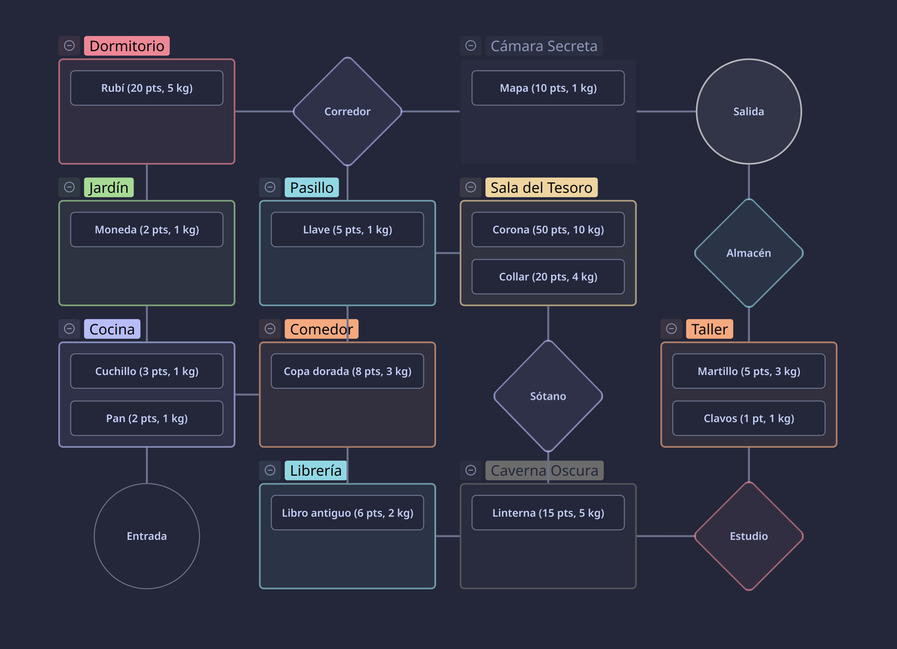

```
        ----       _____                 _      ____                  _   
     `/\(  )      / ____|               | |    / __ \                | |  
    | ^  \       | |  __ _ __ __ _ _ __ | |__ | |  | |_   _  ___  ___| |_ 
    | -  | \o    | | |_ | '__/ _` | '_ \| '_ \| |  | | | | |/ _ \/ __| __|
     /\\ /       | |__| | | | (_| | |_) | | | | |__| | |_| |  __/\__ \ |_ 
      |  |  _o_   \_____|_|  \__,_| .__/|_| |_|\___\_\\__,_|\___||___/\__|
      |  | |___|                    |_|                                   
```
# GraphQuest

**GraphQuest** narra la travesía de un **viajero sin nombre** que se adentra en un antiguo laberinto en busca de tesoros olvidados. Su único objetivo es recolectar objetos valiosos para venderlos en el mercado negro, **luchando con el paso del tiempo** para no sucumbir en este terreno inexplorado. Solo la astucia y la ambición guían su camino, donde cada decisión puede llevarlo a la riqueza… o a perderse para siempre en las penumbras del laberinto. **¿Serás capaz de enfrentar esta mazmorra para volverte una leyenda entre los mercaderes clandestinos?**

<details>
<summary> <b> Mapa General del Juego (Spoilers)</b> </summary>
<div align="center"> <br/>



</div>
</details> 

## Requerimientos
- Tener un compilador de C (como **gcc**) instalado.
    - Para **Windows**, es recomendable utilizar **MinGW**.
    - Para sistemas basados en **Arch Linux**, se puede ejecutar en la terminal el comando `sudo pacman -S gcc` para instalarlo de los **paquetes oficiales** de Arch.

### Compilación y ejecución

<details>
<summary>
Para compilarlo, dentro del sistema operativo <b>Windows</b> usando <b>Visual Studio Code</b>: </summary>

1. Descargar este **repositorio** como archivo `zip` (haciendo **click** en la sección `code`, y apretando el botón de `Descargar ZIP`).
2. Abrir el **explorador de archivos** y navegar hasta el archivo `zip` para descomprimirlo. Una vez descomprimido, abrir el directorio con los archivos del programa.
3. Abrir el archivo `main.c` del `zip` en **Visual Studio Code**.
4. Dentro de **Visual Studio Code**, abrir el **terminal** y dirigirse a la dirección del repositorio, para poder compilar el programa.
5. Ejecutar el siguiente comando: `gcc main.c headers/*.c headers/TDAs/*.c -o programa.exe`.
6. Abrir el archivo `programa.exe`, o escribir la línea `./programa.exe` en **Visual Studio Code** para ejecutarlo.
</details>

---
<details>
<summary>
Una forma alternativa de compilación, funcional para <b>Windows</b> y <b>Linux</b> (<b>Arch Linux</b> <i>testeado</i>): </summary>

1. Descargar el **repositorio** como archivo `zip`.
2. Abrir el **explorador de archivos** de su preferencia y navegar hasta encontrar el archivo `zip` para descomprimirlo.
3. Una vez descomprimido, buscar el directorio donde se ubica la carpeta descomprimida y buscar abrir el **terminal** en algunos de los sistemas operativos.

    - En **Windows**, se puede hacer **click derecho** en el directorio para abrir el menú de opciones y seleccionar para **abrir en Terminal**. Alternativamente, abrir **PowerShell** o **Línea de Comandos**, copiar la dirección del repositorio (la ruta `C:\Users\...`) y ejecutar el comando `cd "C:\Users\..."`.
    - En **Linux**, se puede ejecutar, dentro de la **terminal** de su preferencia, el comando `cd`, similar a como se hace en **Windows**. Es necesario copiar la dirección del repositorio (la ruta `"/home/$USER/..."`) y ejecutar el comando `cd "/home/$USER/..."` para acceder a la ruta del programa.
4. Ejecutar el comando: `gcc main.c headers/*.c headers/TDAs/*.c -o programa`.
5. Escribir en la misma **terminal** el comando `./programa` para ejecutar la aplicación.
</details>

## Funciones del programa

El programa incluye dos **menús esenciales** que son utilizados para la carga del programa:

<details> 
<summary> <b> Menú Principal: </b> </summary>

1. `Cargar Laberinto`: Carga el laberinto desde un archivo CSV y permite que el juego pueda tener los datos para poder jugarse.
2. `Iniciar Partida`: Al tener cargado el laberinto, permite poder iniciar una partida del juego desde cero.

</details>

---
<details>
<summary> <b> Menú del Jugador: </b> </summary>

1. `Recoger Item(s)`: Permite que el jugador pueda recoger los Objetos que hayan en la habitación. Si no hay, no hace nada. Cada vez que se agrega un Objeto al inventario del jugador, aumenta el puntaje total del jugador y el peso de su inventario (en base al Objeto).
2. `Descartar Item(s)`: Permite que el jugador pueda descartar los Objetos que tenga en su inventario. Si no tiene, no hace nada. Cada vez que se descarte un Objeto del inventario del jugador, disminuye el puntaje total y el peso de su inventario (en base al Objeto).
3. `Avanzar a una habitación`: Permite que el jugador avance a una habitación concreta adjunta a la habitación actual. Útil para recorrer el laberinto e ir descubriendo las habitaciones que existen. Si el jugador **decide quedarse** en la habitación, **mostrará el estado actual** de la habitación y sus **estadísticas propias**.
4. `Ver datos de la habitación`: Muestra **solo** los datos actuales de la habitación en la que se encuentra el jugador.
- `Reiniciar Partida`: Permite volver a crear una partida en medio de la partida actual. Vuelve a los valores predeterminados el laberinto y elimina todos los datos del jugador, para iniciar desde cero.
</details>

### Headers Propios

Este proyecto posee headers segmentados, encargados cada uno de distintas **funciones** que se implementaron. Al ser algo más enrevesado, mostraré los **headers esenciales** creados:

- `Extras`: Encargado de funciones varias que implemento en varios de los proyectos del ramo. Fue creada desde la primer tarea, pero ha sido y sigo modificándola para crear más funciones esenciales que uso para los proyectos. También, es la **cabeza de los headers**, implementando los **headers de C** (y **TDAs**) que más he utilizado (`stdio`, `stdlib` y `string`; `list` y `map`) para usarlos en **todos** los demás headers. 
- `GraphQuest`: Es el header encargado de la **funcionalidad de la lectura del laberinto**. Posee funciones propias que se encargan de poder acceder al archivo ubicado en `data` y crear un mapa funcional con las conexiones correspondientes a cada nodo.
- `GameSet`: El **header principal** del programa. Es el que permite el funcionamiento del juego e implementa todos los sistemas que hacen que la aventura pueda ser disfrutada. Posee las funciones que se encargan del **jugador**.
- `Mostrar`: Header especialmente dedicado a imprimir los mensajes que se ven a lo largo del programa. Me permite poder tener todos los mensajes que desee crear en un único lugar, siendo versátil para este programa en específico.

### Advertencias generales

- Al momento de `leer una opción`, el programa leerá el **primer cáracter ingresado**. Si se **agregan más carácteres** después de eso no se considerará como un "problema", pero **tampoco se leerán**.
- Si se **supera** el límite de la entrada del usuario (**200 carácteres máximo**), el programa no podrá interpretar más allá de lo que se ingrese.
- Hay ciertos **carácteres especiales** pertenecientes al estándar `UTF-8` que no son mostrados correctamente dentro del programa. Esto puede ser arreglado en **sistemas usando Windows** aplicando la configuración especial `Beta: Use Unicode UTF-8` ubicado en la sección de **opciones de lenguaje administrativo** (`Administrative language settings`) y **lenguaje para programas no-Unicode** (`Language for non-Unicode programs`).
- Puede que exista la posibilidad de que el programa **no muestre el texto como debería** en sistemas operativos **Windows** (o sistemas sin soporte directo a `BASH`). Esto puede ser **solucionado** si se utiliza la **Terminal de Windows** (con soporte directo; no confundir con **PowerShell** o **CMD**), o implementar la compatibilidad con `BASH` en las demás terminales.
- El MACRO `FORMULA TIEMPO` usada dentro del programa, para restar el tiempo al jugador, puede que no sea similar a la fórmula mostrada en el `Notion` (T = [P.T + 1]/10). Esto lo tomé como una **decisión de diseño**, buscando omitir el uso de la división y haciendo que **el tiempo siempre baje por el casting hecho a `int`**. Siempre que se use el MACRO, **restará por lo menos uno al tiempo**.

## Ejemplos de ejecución

